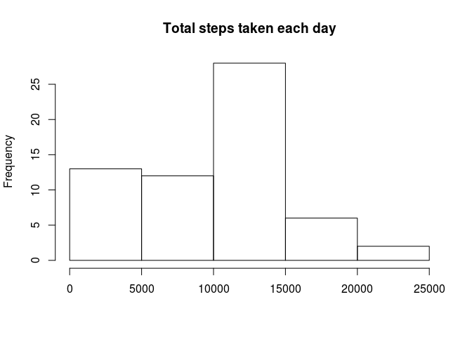
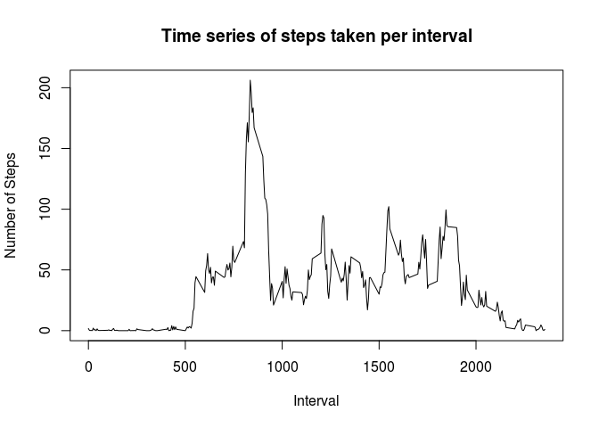

# Reproducible Research: Peer Assessment 1


## Loading and preprocessing the data

```r
data = read.csv("activity.csv")
```


## What is mean total number of steps taken per day?

```r
daysum = tapply(data$steps,data$date, sum, na.rm=T)
hist(daysum, main = "Total steps taken each day",xlab="")
```

<!-- -->

```r
meansteps = mean(daysum, na.rm = T)
medsteps = median(daysum, na.rm = T)
```
The mean number of steps taken each day is 9354.2295082. The median number of steps taken each day is 10395.   

## What is the average daily activity pattern?


```r
intervalfactors = factor(data$interval)
x = as.numeric(as.character(levels(intervalfactors)))
timeseries = tapply(data$steps, data$interval, mean, na.rm = T)
plot(x, timeseries, type = "l",main="Time series of steps taken per interval",xlab="Interval",ylab="Number of Steps")
```

<!-- -->

```r
maxinterval = x[which(timeseries %in% max(timeseries))]
```
The interval with the largest average step value is 835.  

## Imputing missing values


```r
natotal = is.na(data$steps)
nasum = sum(natotal)
```
The total number of missing values is 2304. To correct these values, the median number of steps corresponding to each interval will be imputed.


```r
library(plyr)
# medianvalues = tapply(data$steps, data$interval, median, na.rm = T)
# data$steps = ifelse(is.na(data$steps) ==  TRUE, medianvalues ,data$steps)
# dimnames(medianvalues)

datafixed <- ddply(data, .(interval), function(data) {data$steps[is.na(data$steps)] <- median(data$steps, na.rm=TRUE); return(data)})

daysum = tapply(datafixed$steps,data$date, sum, na.rm=T)
hist(daysum, main= "Total steps taken each day, with missing values imputed", xlab = "")
```

<!-- -->

```r
meansteps = mean(daysum, na.rm = T)
medsteps = median(daysum, na.rm = T)
```

The mean number of steps taken each day is 9503.8688525 when missing values are imputed. The median number of steps taken each day is 9069 when missing values are imputed. The mean value increased when missing values were imputed, but the median value decreased when missing values were imputed.  


## Are there differences in activity patterns between weekdays and weekends?

```r
library(timeDate)
library(ggplot2)
weekend = c('Saturday','Sunday')
datafixed$day <- factor((weekdays(as.Date(datafixed$date)) %in% weekend),levels=c(T,F),labels=c('Weekend','Weekday'))
ggplot(datafixed) + aes(interval, steps) + stat_summary(fun.y = "mean", geom = "line") + 
        facet_grid(.~day)
```

<!-- -->
